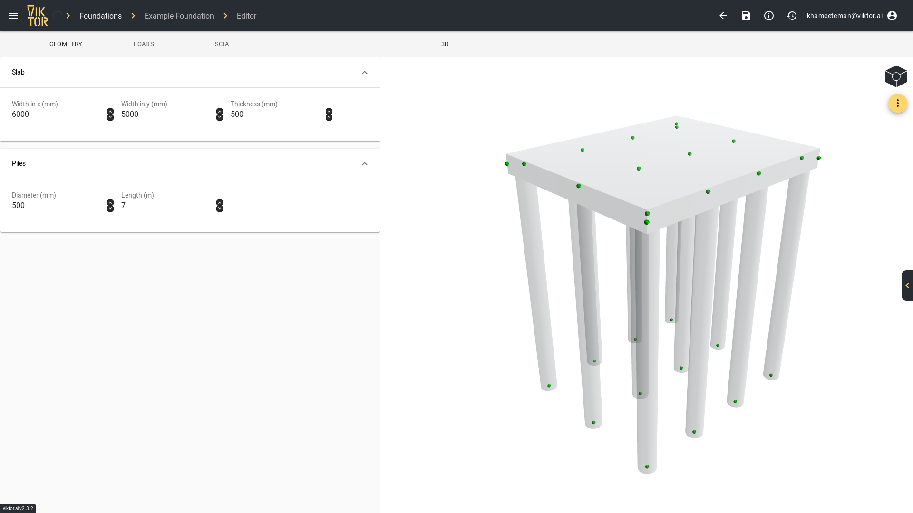
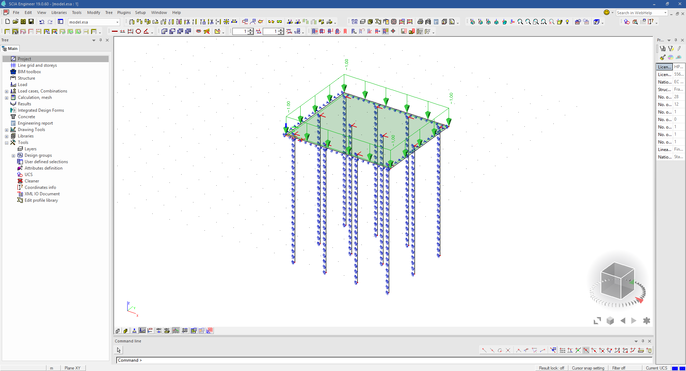

 <Please check version is the same as specified in requirements.txt>

# Creating and analyzing a SCIA model
This sample app shows how a SCIA model can be created within VIKTOR, which can be used for analysis using an external coupling. 
The SCIA model that we will be constructing consists of a foundation slab with piles, as can be seen in the picture bellow.

A full tutorial for this app can be found [here.](https://docs.viktor.ai/docs/guides/tutorials/scia-model)
  
To run this code, you will need a VIKTOR licence, which you can access using our [free version](https://www.viktor.ai/try-for-free). You will need your own SCIA licence for the integration. 

After, the model can be uploaded in the scia environment, like shown in the picture below:

